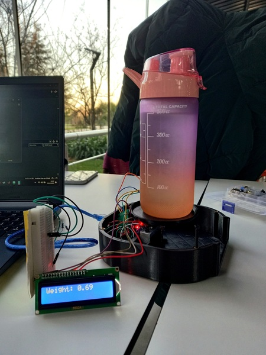

### Smart Water Bottle Project
In this project, we aimed to encourage people to drink more water. To achieve this, we designed a smart bottle base that weighs the bottle and displays encouraging messages based on the weight. 
- Designed the base in Fusion 360 and printed in 3D printer.
- Used load cell, HX711 and Arduino Uno to weigh the bottle.
- Wrote arduino code to display messages.
#### Results

